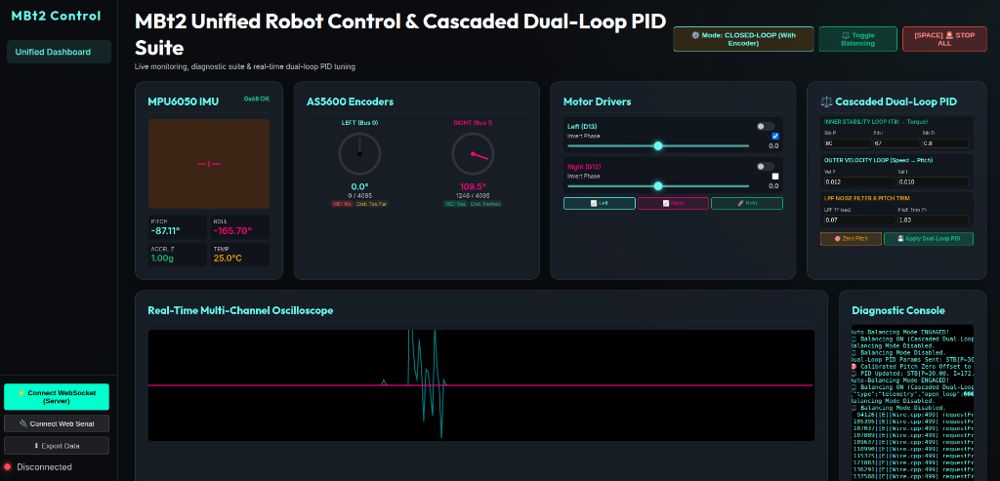
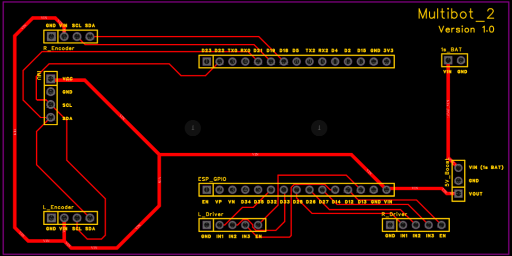
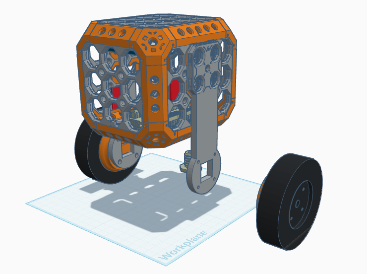

<div align="center">

# 🤖 MBt2: High-Performance Self-Balancing Robot

### *FreeRTOS Dual-Core • SimpleFOC Direct Torque Control • Bluepad32 Bluetooth • Real-Time Web Dashboard*

[](https://www.espressif.com/)
[](https://simplefoc.com/)
[](https://bluepad32.readthedocs.io/)
[](LICENSE)

</div>

---

## 🌟 Overview

**MBt2** is a modular, high-performance 2-wheeled self-balancing robot powered by an **ESP32**, **SimpleFOC** field-oriented motor control, **AS5600** magnetic encoders, an **MPU6050** IMU, and a **Bluepad32** Bluetooth gamepad receiver.

It features a custom **FreeRTOS Dual-Core Architecture**, **Cascaded Dual-Loop PID Control**, and a **Real-Time WebSocket Web Dashboard** for live tuning, 3D orientation visualization, diagnostic metrics, and multi-channel telemetry plotting.

---

## 📸 System Showcase

<div align="center">

### 🖥️ Real-Time WebSocket Web Dashboard & Tuning Suite


</div>

---

## 🚀 Key Features & Engineering Highlights

- ⚡ **FreeRTOS Dual-Core Allocation:**
  - **Core 1 (Priority 10):** Runs SimpleFOC motor control (`loopFOC()` and `move()`) at >20 kHz + 100Hz synchronized IMU sampling and Cascaded Dual-Loop PID execution.
  - **Core 0 (Normal Priority):** Runs Bluepad32 Bluetooth Gamepad processing, AS5600 diagnostic polling, JSON telemetry serialization, and WebSocket command handling.
- 🔒 **Multi-Core I2C Mutex Thread Safety:**
  - A FreeRTOS Mutex Semaphore (`i2c0Mutex`) protects shared I2C Bus 0 (GPIO 21 SDA / GPIO 22 SCL) between MPU6050 (`0x68`) and Left AS5600 (`0x36`), eliminating SDA/SCL bus collisions and data corruption during closed-loop FOC.
- ⚖️ **Cascaded Dual-Loop Direct Torque Control:**
  - **Inner Stability Loop (`pid_stb`):** Fast $P, I, D$ loop converting tilt angle error to direct motor voltage / torque ($U_q$).
  - **Outer Velocity Loop (`pid_vel`):** Measures net physical forward wheel speed `(motorLeft.shaft_velocity - motorRight.shaft_velocity) / 2.0f` and generates a target pitch angle (`target_pitch`) filtered through `lpf_pitch_cmd` ($\text{Tf} = 0.07\text{s}$) to hold position.
- 🎮 **Bluepad32 Bluetooth Gamepad Remote Control:**
  - Pair any Bluetooth gamepad (PS4, PS5, Xbox, Switch Pro, 8BitDo).
  - **Left Stick Y:** Throttle (Forward / Reverse).
  - **Right Stick X:** Steering (Turn Left / Right).
  - Filtered through `lpf_throttle` ($\text{Tf} = 0.4\text{s}$) and `lpf_steering` ($\text{Tf} = 0.1\text{s}$) for smooth acceleration.
- 🛡️ **9.0V Torque Limit & Max Lean Angle Clamp:**
  - 9.0V motor voltage headroom (on a 12V supply) provides 50% more peak acceleration torque.
  - `target_pitch` is clamped to **$\pm 8.6^\circ$** ($\pm 0.15\text{ rad}$), preventing joystick commands from tipping the robot beyond physical recovery limits.
- ⚖️ **Auto-Enable Balancing:**
  - Holding the robot upright near vertical zero ($\pm 3.0^\circ$) for 1 second automatically engages balancing mode (`MotionControlType::torque`). Includes an automatic **45° Tipped-Over Safety Cutoff**.
- 💾 **Browser `localStorage` Persistence:**
  - Tuning parameters set on the web GUI are saved locally in the browser and automatically restored on page refresh.

---

## 🔌 Hardware Architecture & Pinout

<div align="center">



</div>

### Pin Mapping Table
| Device | ESP32 Pin | Function / Protocol |
|---|---|---|
| **MPU6050 IMU** | GPIO 21 (SDA), GPIO 22 (SCL) | I2C Bus 0 (Shared with Mutex) |
| **Left AS5600 Encoder** | GPIO 21 (SDA), GPIO 22 (SCL) | I2C Bus 0 (Shared with Mutex) |
| **Right AS5600 Encoder** | GPIO 18 (SDA), GPIO 19 (SCL) | I2C Bus 1 |
| **Left Motor Driver** | GPIO 32, 33, 14 (PWM) \| GPIO 13 (EN) | 3-Phase Sinusoidal PWM |
| **Right Motor Driver** | GPIO 25, 26, 27 (PWM) \| GPIO 12 (EN) | 3-Phase Sinusoidal PWM |
| **Sensor Power Rail** | 3V3 Pin | 3.3V Logic Protection |

---

## 🧊 3D Mechanical Design & PCB Manufacturing

<div align="center">



| 🧊 3D Chassis (Multiboard System) | ⚡ Custom PCB Carrier Board |
| :---: | :---: |
| [](https://www.tinkercad.com/things/8piVGKb7lwG-multiboard-bot-aka-multibot) | [📄 View PCB Drawings & Gerbers](PCB_Design/) |
| Modular 3D printed hex grid tiles, motor brackets & wheels | 2-Layer custom carrier board with 1-click JLCPCB / PCBWay order ZIP |

</div>

- **3D CAD Model:** 👉 **[View & Edit Multiboard Bot on Tinkercad](https://www.tinkercad.com/things/8piVGKb7lwG-multiboard-bot-aka-multibot)**
- **Hardware Gerber ZIP:** `PCB_Design/MBt2_PCB.zip` (1-click manufacturing order file)
- **Schematic PDF:** `PCB_Design/MBt2_PCB.pdf`
- **Bill of Materials:** 📋 [`PCB_Design/BOM_MBt2_Carrier_Board.csv`](PCB_Design/BOM_MBt2_Carrier_Board.csv)

### 📋 Bill of Materials (BOM) Quick Summary
| Component | Description | Qty | Target Reference |
|---|---|---|---|
| **ESP32 DevKit V1** | 30-Pin Dual-Core Microcontroller | 1 | `U1` |
| **SimpleFOC Mini Driver** | 3-Phase BLDC Motor Driver | 2 | `L_Driver`, `R_Driver` |
| **BLDC Gimbal Motor** | 11 Pole Pair Brushless Motor | 2 | Left & Right Wheels |
| **AS5600 Magnetic Encoder** | 12-Bit Angle Sensor (I2C) | 2 | `L_Encoder`, `R_Encoder` |
| **MPU6050 IMU** | 6-DOF Accelerometer & Gyroscope | 1 | `IMU` |
| **5V Step-Up Boost Module** | 1S LiPo $\rightarrow$ 5V Regulator | 1 | `5V_Boost` |
| **1S LiPo / 18650 Battery** | 3.7V High Discharge Battery | 1 | `1s_BAT` |

---

## ⚡ Quick Start & Usage

### 1. Flash ESP32 Firmware
```bash
cd esp32_firmware
fuser -k /dev/ttyUSB0 || true
platformio run -t upload
```

### 2. Launch Tuning Dashboard
```bash
node tuning_server.cjs
```
Open **[http://localhost:8080/](http://localhost:8080/)** in your web browser.

---

## 🎯 Official Baseline Tuned Parameters

- **Inner Stability Loop:** `Stb P = 80.0`, `Stb I = 67.0`, `Stb D = 0.8`
- **Outer Velocity Loop:** `Vel P = 0.012`, `Vel I = 0.010`
- **LPF Noise Filter:** `LPF Tf = 0.07` s
- **Equilibrium Pitch Trim:** `1.83°`

---

## 🔖 Version History

| Tag / Milestone | Description |
|-----------------|-------------|
| `v1.0-single-core` | Legacy single-core implementation running all tasks in `loop()` on Core 1. |
| `v2.0-dual-core-unified` | **Current State:** FreeRTOS Dual-Core architecture, Bus 0 I2C Mutex, 100Hz Synchronized Cascaded Dual-Loop PID, Bluepad32 Bluetooth Gamepad, Auto-Balancing, 9V Torque Headroom, and Unified Tuning Dashboard. |

---

## 📜 License
Hardware: [CERN-OHL-S v2](https://ohwr.org/cernohl) | Software: [MIT License](LICENSE)
